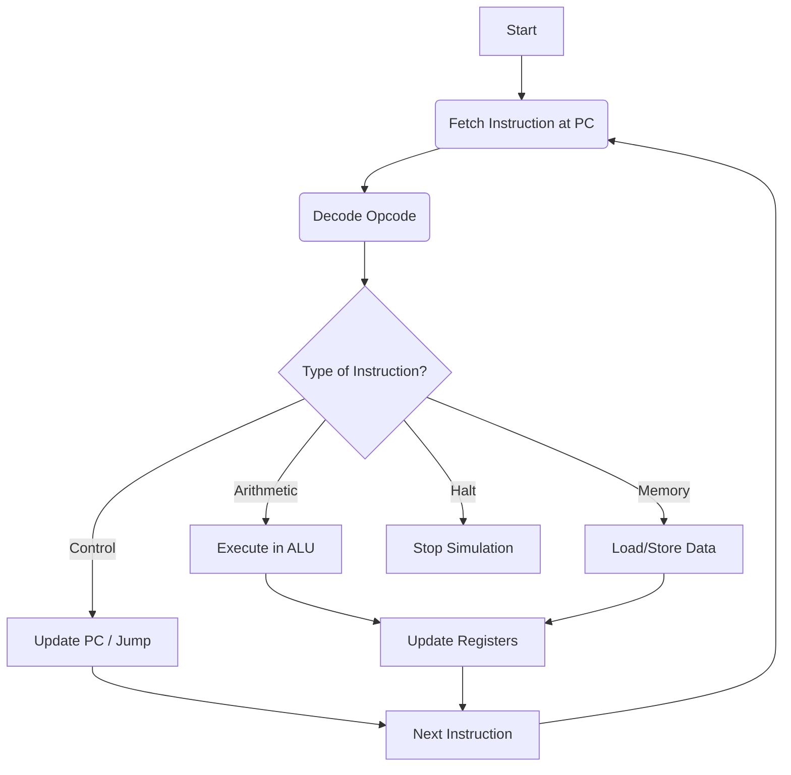

# CPU-Simulator

**A low-level simulation of the Fetch-Decode-Execute cycle implemented in C++.**

This project emulates the internal workings of a Central Processing Unit. It is designed to demonstrate how hardware executes machine code, manages register states, handles memory operations, and controls program flow through a custom Instruction Set Architecture (ISA).

---

## 🧠 System Architecture

### The Instruction Cycle

The core of this simulator is the infinite loop that powers all modern processors:

1. **Fetch:** Retrieve the instruction from memory at the current Program Counter (PC).
2. **Decode:** Interpret the opcode to determine the operation and identify operands.
3. **Execute:** Perform the computation, memory access, or control flow change.



### Instruction Set Architecture (ISA) Design

* **Registers:** 8 General Purpose Registers (`R0` - `R7`).
* **Memory:** 64KB addressable memory space.
* **Instruction Format:** `[ Opcode | Operand 1 | Operand 2 | Destination ]`

#### Supported Operations (Opcodes)

| Category | Opcode | Description |
| --- | --- | --- |
| **Arithmetic** | `ADD`, `SUB`, `MUL`, `DIV` | Standard math operations on registers. |
| **Memory** | `LOAD`, `STORE` | Transfer data between memory and registers. |
| **Control** | `JMP`, `JZ`, `JNZ` | Unconditional and conditional jumps (branching). |
| **Misc** | `NOP`, `HALT` | No operation and terminate program. |

---

## 🗺️ Project Roadmap

This project is divided into 7 key milestones.

### Phase 1: Foundation

* [ ] **Milestone 1: Design the Instruction Set**
* Define Opcodes, Instruction Format, and Register/Memory sizing.


* [ ] **Milestone 2: Build Data Structures**
* Implement `Instruction` struct, Register File (Array), Memory (Array), and Program Counter (PC).


### Phase 2: Core Execution

* [ ] **Milestone 3: The Execution Loop**
* Implement the Fetch → Decode → Execute loop.
* Handle basic arithmetic and the `HALT` command.


* [ ] **Milestone 4: Control Flow**
* Implement branching logic (`JMP`, `JZ`, `JNZ`) to allow loops and conditional logic.


### Phase 3: Memory & Debugging

* [ ] **Milestone 5: Memory Operations**
* Implement `LOAD` and `STORE` to allow dynamic reading/writing to the heap.
* (Optional) Implement Stack operations (`PUSH`, `POP`).


* [ ] **Milestone 6: Debugging Tools**
* specific logging to visualize the state of the CPU after every cycle.


### Phase 4: Advanced Features (Optional)

* [ ] **Milestone 7: Enhancements**
* Support for Immediate values.
* Simple Assembler (Text-to-Struct converter).
* Interrupts/Timers.


---

## 🛠️ Getting Started

### Prerequisites

* C++ Compiler (g++ or clang)
* Make (optional, if using a Makefile)

### Building and Running

1. Clone the repository:
```bash
git clone https://github.com/yourusername/cpu-simulator.git

```


2. Compile the project:
```bash
g++ -o cpu_sim main.cpp

```


3. Run the simulator:
```bash
./cpu_sim

```


---

## 📚 Concepts Learned

* **Computer Architecture:** Understanding how hardware components (ALU, CU, Registers) interact.
* **Low-Level Logic:** Bitwise operations, masking, and binary arithmetic.
* **Systems Programming:** Managing state machines and memory simulation in C++.
* **Virtualization:** Creating a software model of hardware behavior.
